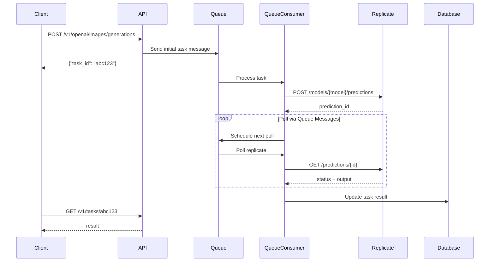
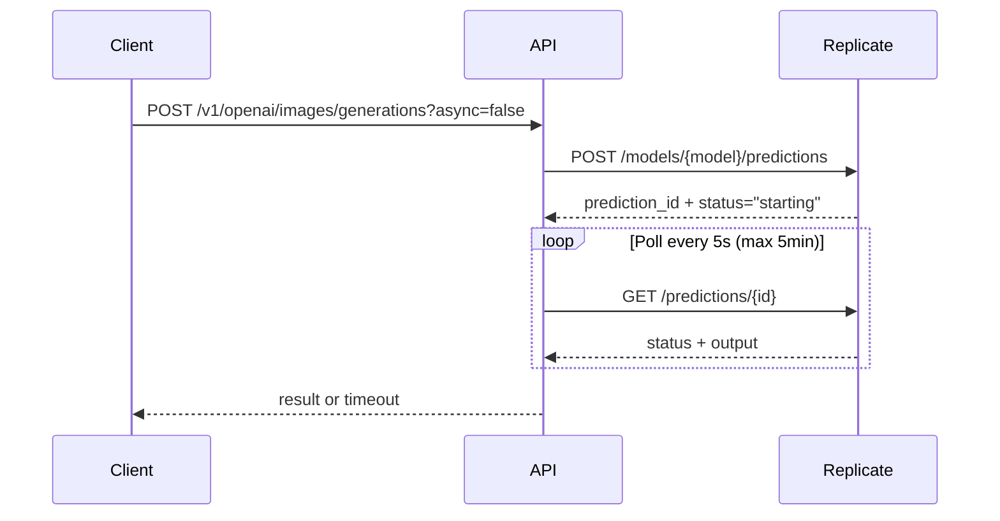

# Replicate Polling Architecture

## Overview

Replicate integration uses **async-first architecture** with two polling methods:

### 1. **Asynchronous Queue Polling** (Default - Production)
- **Default behavior** - no `async` parameter needed  
- Immediate response with task ID
- Uses Cloudflare Queue system for distributed polling
- Client polls `/v1/tasks/{taskId}` for completion
- **Scalable** - no connection timeouts or worker limits
- **Production ready** - handles high traffic and long-running models

### 2. **Synchronous Polling** (Development Only)
- Used when explicitly `async=false` parameter is provided
- Immediate HTTP response with result
- Uses `pollReplicatePrediction()` utility for blocking polls
- **Not recommended** - hits Cloudflare Worker execution limits
- **Timeouts**: 
  - Images: 5 minutes (60 attempts × 5s intervals)
  - Videos: 20 minutes (240 attempts × 5s intervals)

## Request Flow

### Async Request (Default: `/v1/openai/images/generations`)


### Sync Request (Development: `/v1/openai/images/generations?async=false`)


## Implementation Details

### Sync Polling (replicateUtils.ts)
```typescript
pollReplicatePrediction(getUrl, providerKey, {
  pollingInterval: 5000,     // 5 seconds between polls
  maxAttempts: 60           // 5 minutes total for images
})
```

### Async Polling (queueConsumer.ts)
- Uses existing queue infrastructure
- Handles Replicate alongside Google, FAL, etc.
- Database tracking for task status
- Automatic retries and error handling

## Best Practices

### When to Use Async vs Sync

**Use Async (Default) For:**
- **All production applications** - scalable and reliable
- Complex image models (> 1 minute)  
- All video models (always long-running)
- High-traffic scenarios
- Multi-user applications

**Use Sync (async=false) For:**
- **Development/testing only**
- Quick image models (< 30 seconds)
- Local development environments
- Debugging and troubleshooting

### Cloudflare Worker Limitations
- **CPU Time**: 10s free / 30s paid tiers
- **Execution Time**: Sync polling may hit limits
- **Recommendation**: Use `async=true` for production

## Configuration

### Environment Variables
```bash
REPLICATE_API_KEY=r8_xxx...        # Required
ASYNC_QUEUE=your-queue-name        # For async mode
```

### Model Configuration
```typescript
providers: [{
  id: 'replicate',
  model_name: 'stability-ai/sdxl:abc123',
  pricing: { type: 'FIXED', value: 0.03 }
}]
```

## Error Handling

### Sync Mode Errors
- Network timeouts → Retry with exponential backoff
- API errors → Immediate failure with error details  
- Polling timeout → Return timeout status (no refund)

### Async Mode Errors  
- Initial submission failure → Task marked as failed
- Polling errors → Automatic retries via queue
- Final timeout → Task marked as timeout

## Monitoring

### Logs
- Sync: `console.warn` for long-running predictions
- Async: Queue consumer logs with task IDs
- Both: Full error details with provider responses

### Metrics
- Task completion rates
- Average processing times  
- Error rates by provider
- Queue depth and processing speed